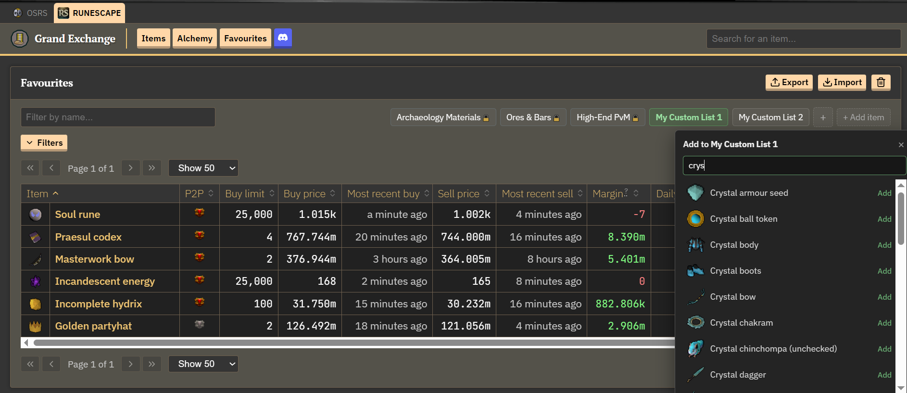

# RS3 Wiki Price List Switcher

A Tampermonkey userscript for the RuneScape 3 Wiki Price Database that adds support for multiple custom favourite-item lists.

Lists appear beside the **Filter by name** bar, allowing you to quickly switch between different groups of items.



## Features

- Create and manage multiple favourite lists
- Import lists from JSON files
- Share lists using a simple JSON format
- Switch between lists directly from the favourites page
- Search the RS3 item database when adding individual items
- Automatically resolve item names to RuneScape item IDs
- Automatically reorder the favourites table to match the selected list
- Rename and delete custom lists
- Persistent lists using browser `localStorage`
- Load repository-hosted default lists from JSON
- Locked default lists that cannot be edited or deleted

## Installation

### Option 1 — Install from GitHub

1. Install [Tampermonkey](https://www.tampermonkey.net/).
2. Open the `RS3 Wiki Price List Switcher.user.js` file in this repository.
3. Click **Raw**.
4. Tampermonkey should open the script installation page.
5. Click **Install**.

### Option 2 — Install Manually

1. Install [Tampermonkey](https://www.tampermonkey.net/).
2. Create a new userscript.
3. Copy the contents of `RS3 Wiki Price List Switcher.user.js`.
4. Paste it into the editor.
5. Save the script.

## Lists

The script supports two types of lists:

- **Default lists** — loaded from the repository's JSON file and locked.
- **User lists** — created or imported by the user and fully editable.

### Default Lists

Default lists are loaded from the configured `preset-lists.json` URL.

They are read-only and cannot be renamed, deleted, or manually edited.

### Creating a List

Click the **+** button beside the list buttons and enter a name.

You can then add items individually using **+ Add item**.

### Importing a JSON List

You can also create lists by importing a JSON file.

This is useful for sharing lists, backing them up, or importing large collections of items.

Imported lists become normal user lists and can be edited afterward.

## JSON Format

A JSON list uses an object containing list names and arrays of item names.

```json
{
    "Mining Supplies": [
        "Coal",
        "Iron ore",
        "Mithril ore",
        "Adamantite ore"
    ]
}
```

Multiple lists can be included in one file:

```json
{
    "Mining Supplies": [
        "Coal",
        "Iron ore",
        "Mithril ore"
    ],
    "Bossing Supplies": [
        "Prayer potion(4)",
        "Super restore(4)",
        "Saradomin brew(4)"
    ]
}
```

Each property becomes a separate list.

The order of the items in each array determines their order in the favourites table.

## Sharing Lists

Because lists use a simple JSON format, they can easily be shared with other users.

For example, a file such as `my-bossing-list.json` can be imported by another user to recreate the same list.

## Editing Lists

User-created lists can be edited using the controls beside the filter bar.

- **+ Add item** — search for and add an item.
- **Right-click → Rename list** — rename a user list.
- **Right-click → Delete list** — remove a user list.

Default lists are locked and do not have these editing options.

## Item Ordering

The order of items in a list controls the order of the corresponding rows on the favourites page.

Items not contained in the selected list are placed after the listed items.

## Storage

User-created and imported lists are stored locally in your browser using `localStorage`.

The active list is also remembered between sessions.

The script synchronizes the selected list with the favourites storage used by the Price Database site.

Clearing browser/site storage can remove your saved lists.

## Default List Updates

Default lists are loaded from the configured JSON source whenever the script starts.

This allows the repository's `preset-lists.json` to be updated without requiring users to reinstall the userscript.

User-created and imported lists remain separate from the default lists.

## API Usage

The script uses the RS3 Wiki Price Database mapping endpoint to resolve item names to item IDs:

`https://prices.runescape.wiki/api/v2/rs/mapping`

The configured default-list JSON is also retrieved using `fetch()`.

## Troubleshooting

### Default lists are missing

Check that the configured `DEFAULT_LISTS_URL` is reachable.

### An item is missing

Make sure the item name matches the name used by the RS3 Wiki item mapping.

Unresolved items are reported in the browser console.

### Imported JSON does not work

Make sure the file contains valid JSON and follows the format described above.

### Items are in the wrong order

The order in the JSON array determines the order of the list.

## Repository Structure

```text
rs3-wiki-price-helper/
├── RS3 Wiki Price List Switcher.user.js
├── preset-lists.json
├── README.md
└── LICENSE
```

## Contributing

Bug reports, suggestions, and improvements are welcome.

When reporting an issue, please include:

- Browser
- Userscript manager
- Script version
- Relevant console errors
- Steps to reproduce the problem

## License

This project is licensed under the **GNU General Public License v3.0 (GPL-3.0)**.

See [LICENSE](LICENSE) for the complete license text.

## Disclaimer

This project is an independent userscript and is not affiliated with, endorsed by, or officially associated with Jagex or the RuneScape Wiki.

Use it at your own discretion.
